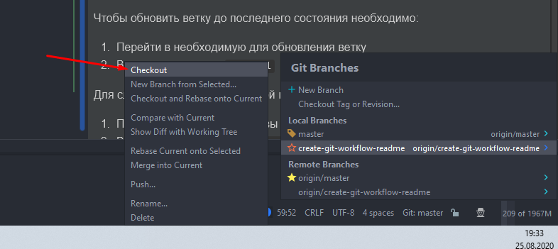

# -Internship-Guide-
This guide contains all needed knowledge to simplify internship process


##Git workflow
У системы контроля версий(Git) две основных задачи:
1. Хранить информацию о всех изменениях в вашем коде, начиная с самой первой строчки
2. Обеспечение удобства командной работы над кодом.

Репозиторий Git — это место, где хранится ваш код и вся информация о его изменениях.
Репозитории могут находиться у вас на компьютере, на компьютерах ваших коллег и на удалённом сервере.

Обычно работа с Git выглядит так:

1. Сверстали шапку сайта — сделали commit;
2. Сверстали контент страницы — сделали второй commit;
3. Закончили верстать страницу — сделали третий commit и отправили код на сервер, чтобы вашу работу могли увидеть коллеги, либо чтобы опубликовать страницу;

Базовый GitFlow на большинстве проектов представлен двумя основными ветками (master и develop) и работой с ними:
* Ветка master зачастую используется для создания релизов, хранения истории о релизах и публикации их на сервере;
* Ветка develop необходима непосредственно для разработки и хранения истории работы над проектом;

Для разработки определенной фичи/фикса бага используют отдельные ветки, которые создаются на основе develop ветки.
Чтобы создать feature ветку необходимо:
1. Перейти на develop ветку
2. Создать новую ветку соблюдая правила нейминга(Имя feature ветки должно начинатся с номера воркайтема и иметь то же описание)

После окончания работы в feature ветке необходимо создать Pull Request(далее PR) в Git репозиторие для дальнейшего код ревью

После код ревью и фикса всех коментариев необходимо завершить PR, после чего ваша feature ветка автоматически вмерджится в develop ветку.

При успешном мердже в develop вам необходимо будет актуализировать все остальные feature ветки, в которых ведутся работы(Если таковые имеются)

Для этого необходимо:
1. Перейти на ветку develop 
2. Обновить ветку после завершения PRа
3. Перейти на вашу feature ветку с помощью
4. Вмерджить изменения из develop ветки
5. После этого для обновления всех остальных веток необходимо повторить шаги 3 и 4 до последующего обновления develop

### Гайды по операциям с Git с помощью git bash/терминала

#### Чтобы перейти на существующую ветку необходимо:
1. Открыть терминал/git bash в корне проекта
2. Написать команду ```git checkout <имя ветки>```

#### Чтобы создать ветку в git необходимо:
1. Открыть терминал/git bash в корне проекта
2. Написать команду ```git checkout -b <имя ветки>```

#### Чтобы обновить ветку до последнего состояния необходимо:
1. Перейти в необходимую для обновления ветку
2. Выполнить команду ```git pull```

#### Для слияния одной ветки с другой необходимо:
1. Перейти в ветку, в которую вы хотите выполнить слияние
2. Выполнить команду ```git merge <имя ветки, которую необходимо вмерджить>```

### Гайды по операциям с Git с помощью Webstorm IDE

#### Чтобы перейти на существующую ветку необходимо:
> 1. 
Кликнуть имя текущей ветки в нижнем правом углу
> 2. 
В открытом окне выбрать из списка необходимую ветку и кликнуть по ней
> 3. 
В новом сеню нажать на Checkout
> 4. После этого имя текущей ветки отобразится в нижнем правом углу

#### Чтобы создать ветку в git необходимо:
> 1. 
> Кликнуть имя текущей ветки в нижнем правом углу
> 2. 
> В открытом меню кликнуть на пункт New Branch
> 3. 
> В модальном окне в поле New branch name задать имя ветки и кликнуть на кнопку Create.
> Если необходимости переходить на новую ветку сейчас нет то нужно убрать чекбокс Checkout branch
> 4. После этого имя новой ветки отобразится в нижнем углу, если чекбокс перехода был активен. В противном случае ветку можно найти в списке всех веток.


#### Чтобы обновить ветку до последнего состояния необходимо:
> 1. 
Кликнуть на кнопку Update Project в верхнем правом углу
> 2. 
В модальном окне нажать Ok

Или

> 1. 
>   В верхнем меню кликнуть на VCS
> 2. 
> Кликнуть на Update project
> 3. 
> В модальном окне нажать Ok

#### Для слияния одной ветки с другой необходимо:
> 1. Перейти в ветку, в которую вы хотите выполнить слияние
> 2. 
>  Кликнуть имя текущей ветки в нижнем правом углу
> 3. 
> В открытом окне выбрать из списка необходимую ветку и кликнуть по ней
> 4. 
> В открытом меню кликнуть на пункт Merge into current
